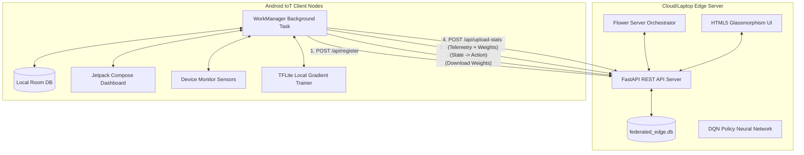
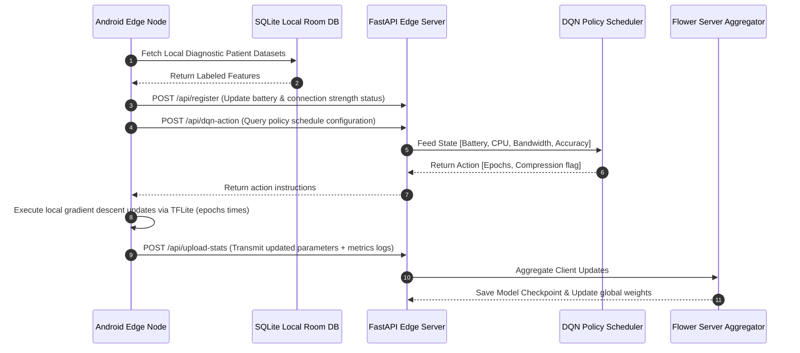

# System Architecture & Data Flow

This document details the software architecture, class relations, and data flow of the **AI-Driven Energy-Aware Federated Edge Learning Framework**.

---

## 1. System Architecture Diagram

---

## 2. Data Flow Diagram (DFD Level 1)

